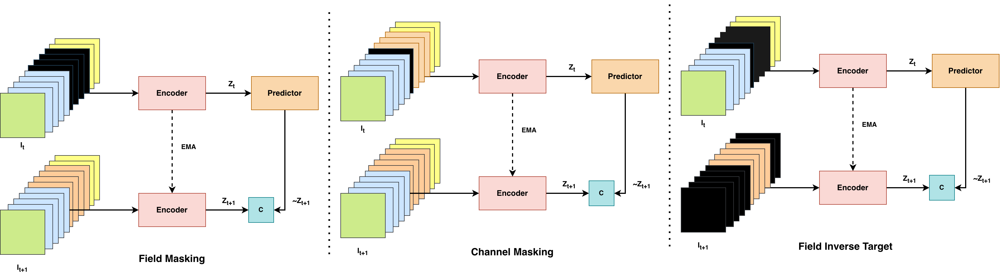

# Enriched Physical Representations by Predicting Missing Physical Attribute Latents

Self-supervised representation learning on the `polymathic-ai/active_matter` dataset
using physically-augmented Video JEPA (Joint-Embedding Predictive Architecture),
plus an end-to-end supervised baseline. Frozen encoders are evaluated with both
**linear probe** and **kNN regression** on the (α, ζ) physical parameters.

---

## Overview

Standard JEPA objectives lack explicit incentives to capture complex physical
structure. This work augments the JEPA objective to **predict latent representations
of missing physical fields**, forcing the model to infer unobserved physical quantities
from complementary signals. This yields more physically meaningful, disentangled
representations and improves downstream parameter estimation — particularly for α
under kNN evaluation.

---

## Architecture

The diagram below illustrates the three masking strategies explored in this work.
**Field Masking** zeros all channels of a physical attribute (e.g. velocity) at a
designated timestep. **Channel Masking** zeros a single random channel. **Field
Inverse Target** additionally masks the target encoder to only the masked field's
channels at t+1, forcing cross-modal temporal prediction. Field Masking worked best 
among the proposed strategies.



### Model components

| Component | Architecture | Params |
|---|---|---|
| Context Encoder | ViT-Small (depth=12, dim=384, heads=6) | ~2.5M |
| Target Encoder | EMA copy of context encoder | — |
| Predictor | Narrow ViT (depth=6, dim=192, heads=6) | ~0.8M |
| **Total** | | **~3.3M** |

**Input:** 16 frames × 224×224 × 11 physical channels  
**Patching:** 3D tubelets (2 × 16 × 16) → 1568 patches per clip  
**Masking:** Field-level masking applied at 50% of training steps (alternating with
standard unmasked JEPA steps)

---

## Field Masking

At each training step, a physical field index k is sampled uniformly from
{concentration, velocity, orientation, strain} and all corresponding channels are
zeroed in the context input. The prediction target remains the **full** next-frame
representation. Since k is resampled every step, the encoder cannot specialize to
any fixed field subset — it must maintain representations sufficient to predict the
complete next-frame state from any partial observation.

Field masking is applied at 50% of steps, alternating with standard unmasked JEPA
steps to preserve stable temporal prediction as the primary objective.

## Masking Frequency

Field masking is applied at every other training step (`mask_period: 2`, i.e. 50% of steps), alternating with standard unmasked JEPA steps. Masking at every step was found to degrade representation quality: the encoder collapses toward inter-field inference, encoding each field only implicitly through its correlations with others rather than maintaining a self-sufficient representation. Alternating ensures the primary temporal-prediction objective remains stable while the masking objective provides a regularising signal that encourages field-disentangled representations.

---

## Dataset

`polymathic-ai/active_matter` — 52 GB, from [The Well](https://huggingface.co/polymathic-ai).

| Split | Samples |
|---|---|
| Train | 8,750 |
| Validation | 1,200 |
| Test | 1,300 |

Each sample is a tensor of shape `[16, 224, 224, 11]` (time × height × width × channels).
The 11 channels decompose into four physically meaningful fields:

| Field | Channels | Description |
|---|---|---|
| Concentration (c) | 1 | Zeroth moment of ψ — local particle density |
| Velocity (U) | 2 (ux, uy) | Activity-driven fluid velocity (Stokes equations) |
| Orientation tensor (D) | 4 (D11, D12, D21, D22) | Nematic order parameter — mean alignment direction |
| Strain-rate tensor (E) | 4 (E11, E12, E21, E22) | Symmetric velocity gradient — local deformation rate |

**Physical parameters (evaluation labels only):**
- α — active dipole strength (5 discrete values)
- ζ — steric alignment strength (9 discrete values); 45 unique (α, ζ) combinations

---

## Results

### Linear Probe (100 epochs, frozen encoder)

| Encoder | α MSE | ζ MSE | avg MSE |
|---|---|---|---|
| Baseline JEPA (VICReg) | 0.613 | 0.724 | 0.669 |
| EMA-temporal V-JEPA | **0.034** | 0.781 | **0.407** |
| Field-mask EMA V-JEPA | 0.089 | 0.876 | 0.482 |
| Supervised (end-to-end) | — | — | 0.055 |

### kNN Regression (k=20, frozen encoder)

| Encoder | α MSE | ζ MSE | avg MSE |
|---|---|---|---|
| Baseline JEPA (VICReg) | 0.996 | 0.988 | 0.992 |
| EMA-temporal V-JEPA | 0.683 | 0.859 | 0.771 |
| Field-mask EMA V-JEPA | **0.077** | **0.759** | **0.418** |
| Supervised encoder → kNN | 0.002 | 0.111 | 0.056 |

**Key findings:**
- EMA teacher substantially improves over shared-weights VICReg baseline under linear probe (α: 0.613→0.034)
- Field masking re-organises representations toward more locally clustered, label-aware geometry — stronger under kNN (0.771→0.418 avg) than linear probe
- Field masking reduces over-reliance on any single field: orientation raw MSE drops from ≈0.57 to ≈0.23 in the zero-masking ablation, and per-channel scores become more balanced

### Masking Strategy Ablation (20% data subset)

| Method | Rep MSE ↓ | FT MSE ↓ |
|---|---|---|
| Field masking (zero token) | 1.770 | 0.639 |
| Channel masking | 1.760 | 0.692 |
| Field Inverse Target | 1.982 | 0.977 |

> Field Inverse Target (cross-modal + temporal prediction simultaneously) was found intractable for the predictor capacity used — representation loss plateaued immediately.

---

## Setup

### 1. Install dependencies

```bash
pip install -r requirements.txt
```

### 2. Download data (on HPC — run from `dtn.torch.hpc.nyu.edu`)

```bash
export NETID=<your_netid>
bash download_data.sh
```

---

## Running on HPC (SLURM)

All training and evaluation is launched through two SLURM scripts:

```bash
# Self-supervised / supervised pre-training
sbatch slurm_train.sh

# Linear-probe or kNN evaluation of a frozen encoder
sbatch slurm_fine_tune.sh
```

Each SLURM script wraps a Singularity container, sets the env, and invokes:

```bash
bash scripts/active_matter/<run_script>.sh [args]
```

To switch between methods or evaluation modes, **edit only that final `bash scripts/active_matter/...` line** in the relevant SLURM script.

### `slurm_train.sh` — pre-training

| Goal | Config | Inner command |
|---|---|---|
| **Field JEPA** (proposed) | `train_activematter_field_jepa.yaml` | `bash scripts/active_matter/run_train_field_jepa.sh` |
| **Channel JEPA** (ablation) | `train_activematter_channel_jepa.yaml` | `bash scripts/active_matter/run_train_channel_jepa.sh` |
| **Field Inverse Target** (ablation) | `train_activematter_field_inverse_target.yaml` | `bash scripts/active_matter/run_train_field_inverse_target.sh` |
| V-JEPA (EMA teacher, smooth-L1) | `train_activematter_vjepa.yaml` | `bash scripts/active_matter/run_train_vjepa.sh` |
| Standard CNN-JEPA (VICReg baseline) | `train_activematter_small.yaml` | `bash scripts/active_matter/run_train_jepa.sh` |
| Supervised baseline (end-to-end) | `train_activematter_supervised.yaml` | `bash scripts/active_matter/run_train_supervised.sh` |

### `slurm_fine_tune.sh` — frozen-encoder evaluation

Pretrained checkpoints are committed under [checkpoints/](checkpoints/):

| Pretrained encoder | Checkpoint path |
|---|---|
| Original CNN-JEPA (VICReg, baseline) | `checkpoints/active_matter-16frames-cnn-jepa-baseline-full/ConvEncoder_29.pth` |
| EMA-temporal V-JEPA | `checkpoints/active_matter-16frames-cnn-jepa-vjepa-ema-temporal-full/ConvEncoder_29.pth` |
| Field-mask + EMA V-JEPA | `checkpoints/active_matter-16frames-cnn-jepa-vjepa-fieldmask-ema-temporal-full/ConvEncoder_29.pth` |
| Supervised baseline (end-to-end) | `checkpoints/active_matter-16frames-cnn-supervised-baseline-linear/ConvEncoder_29.pth` |

| Goal | Inner command |
|---|---|
| JEPA / V-JEPA → **linear probe** | `bash scripts/active_matter/run_finetune_jepa_linear.sh <ConvEncoder_xx.pth>` |
| JEPA / V-JEPA → **kNN regression** | `bash scripts/active_matter/run_finetune_jepa_knn.sh <ConvEncoder_xx.pth>` |
| Supervised encoder → **linear probe** | `bash scripts/active_matter/run_finetune_supervised_linear.sh <ConvEncoder_xx.pth>` |
| Supervised encoder → **kNN regression** | `bash scripts/active_matter/run_finetune_supervised_knn.sh <ConvEncoder_xx.pth>` |

### Reproducing the reported numbers

| # | Encoder | Pretrain command | Eval head | Eval command | Approx. val MSE (avg) |
|---|---|---|---|---|---|
| 1 | Baseline JEPA (VICReg) | `run_train_jepa.sh` | linear | `run_finetune_jepa_linear.sh ...ConvEncoder_29.pth` | 0.669 |
| 2 | Baseline JEPA (VICReg) | (same as #1) | kNN (k=20) | `run_finetune_jepa_knn.sh <same ckpt>` | 0.99 |
| 3 | EMA-temporal V-JEPA | `run_train_vjepa.sh` | linear | `run_finetune_jepa_linear.sh ...ConvEncoder_29.pth` | 0.407 |
| 4 | EMA-temporal V-JEPA | (same as #3) | kNN (k=20) | `run_finetune_jepa_knn.sh <same ckpt>` | 0.771 |
| 5 | **Field JEPA** (proposed) | `run_train_field_jepa.sh` | linear | `run_finetune_jepa_linear.sh ...ConvEncoder_29.pth` | — |
| 6 | **Field JEPA** (proposed) | (same as #5) | kNN (k=20) | `run_finetune_jepa_knn.sh <same ckpt>` | — |
| 7 | **Channel JEPA** (ablation) | `run_train_channel_jepa.sh` | linear | `run_finetune_jepa_linear.sh ...ConvEncoder_29.pth` | — |
| 8 | **Channel JEPA** (ablation) | (same as #7) | kNN (k=20) | `run_finetune_jepa_knn.sh <same ckpt>` | — |
| 9 | **Field Inverse Target** (ablation) | `run_train_field_inverse_target.sh` | linear | `run_finetune_jepa_linear.sh ...ConvEncoder_29.pth` | — |
| 10 | **Field Inverse Target** (ablation) | (same as #9) | kNN (k=20) | `run_finetune_jepa_knn.sh <same ckpt>` | — |
| 11 | Supervised baseline | `run_train_supervised.sh` | end-to-end linear | (training itself is the eval — see `val/loss` in wandb) | 0.055 |
| 12 | Supervised encoder | (same as #11) | kNN (k=20) | `run_finetune_supervised_knn.sh ...ConvEncoder_29.pth` | 0.056 |

#### Common Hydra overrides

```bash
# Sweep different k values for kNN
'ft.n_neighbors_list=[1,5,15]'
ft.knn_weights=uniform        # default: distance
ft.knn_metric=cosine          # default: minkowski (L2)

# Linear probe knobs
ft.lr=5e-4
ft.num_epochs=200
ft.batch_size=64

# Reseed
--seed 7
```

### Logged metrics

- `val/loss` — mean MSE over both targets in z-scored space
- `val/loss_dim_0` — MSE on **α** (alpha)
- `val/loss_dim_1` — MSE on **ζ** (zeta)

kNN additionally logs `knn/k` per step and `best/k`, `best/val_loss`, `best/val_loss_dim_*` in `wandb.summary`.

---

## Constraints

- No pretrained weights
- No external data
- Evaluation: frozen backbone only (no fine-tuning of encoder)
- Parameter count < 100M
- Labels (α, ζ) used only for evaluation, not training

---

## Data Subsets

Subset configs are generated by `generate_all_subsets.sh` and stored in `subset_configs/`.

| Config file | Alpha values | Zeta values | Traj/pair | ~Dataset % | Expected use |
|---|---|---|---|---|---|
| `subset_a5_z5_20pct.json` | all 5 (-1…-5) | 5 evenly spaced (1,5,9,13,17) | 2 | ~20% | Baseline ablation with full phase space coverage at low cost |
| `subset_a5_z5_40pct.json` | all 5 (-1…-5) | 5 evenly spaced (1,5,9,13,17) | 4 | ~40% | More data per param pair, same phase space coverage |
| `subset_a5_z9_40pct.json` | all 5 (-1…-5) | all 9 (1,3,5,7,9,11,13,15,17) | 2 | ~40% | Full zeta coverage, tests whether denser zeta sampling helps |
| `subset_a3_z3_10pct.json` | 3 extreme (-1,-3,-5) | 3 extreme (1,9,17) | 2 | ~10% | Minimal subset covering extreme corners of phase space only |
| `subset_a3_z5_15pct.json` | 3 extreme (-1,-3,-5) | 5 evenly spaced (1,5,9,13,17) | 2 | ~15% | Reduced alpha diversity, full zeta range |
| `subset_a5_z9_100pct.json` | all 5 (-1…-5) | all 9 (1,3,5,7,9,11,13,15,17) | all | 100% | Full dataset, no subsampling |

To use a subset, pass `dataset.subset_config_path` as a Hydra override on the command line — works with any training script:
```bash
bash scripts/active_matter/run_train_field_jepa.sh \
    'dataset.subset_config_path=configs/dataset/subset_configs/subset_a5_z5_20pct.json'
```

---

## Experiment Tracking

All runs are logged to W&B at:  
[https://wandb.ai/ar9799-new-york-university/physics-jepa/overview](https://wandb.ai/ar9799-new-york-university/physics-jepa/overview)

Run-name conventions:
- `activematter-baseline-full-FT-linear` — baseline JEPA + linear probe
- `activematter-jepa-baseline-full-FT-knn` — baseline JEPA + kNN
- `activematter-vjepa-ema-temporal-full-FT-{linear,knn}` — EMA-temporal V-JEPA
- `activematter-vjepa-fieldmask-ema-temporal-full-FT-{linear,knn}` — field-mask V-JEPA
- `active_matter-16frames-cnn-supervised-baseline-linear` — end-to-end supervised
- `activematter-supervised-baseline-FT-knn` — supervised encoder + kNN

---

## References

- [V-JEPA 2 (Bardes et al., 2025)](https://arxiv.org/abs/2404.08471)
- [V-JEPA (Bardes et al., 2024)](https://arxiv.org/abs/2404.08471)
- [I-JEPA (Assran et al., CVPR 2023)](https://arxiv.org/abs/2301.08243)
- [JEPA / LeCun 2022](https://openreview.net/forum?id=BZ5a1r-kVsf)
- [EB-JEPA GitHub](https://github.com/facebookresearch/jepa)
- [The Well / active_matter](https://huggingface.co/datasets/polymathic-ai/active_matter)
- [Baseline paper: arXiv:2603.13227](https://arxiv.org/abs/2603.13227)
